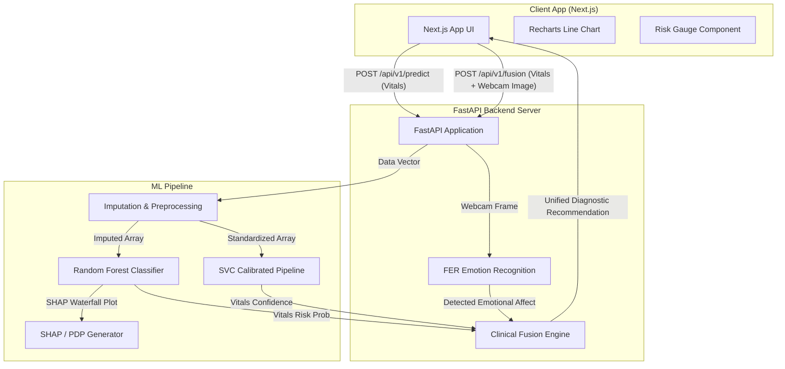

# 🩺 BioSense AI: HealthGuard System

    

Welcome to **BioSense AI**, a state-of-the-art multimodal clinical intelligence platform. The HealthGuard system bridges the gap between physiological diagnostics and psychological indicators, providing a comprehensive AI-driven health assessment for both patients and clinicians.

The architecture connects a responsive **Next.js Web Frontend** to a high-performance **FastAPI Backend Server** that drives our machine learning inference and affective vision algorithms, complete with interactive 24h risk trajectory charts and detailed explainability metrics.

---

## 📐 System Architecture

The following diagram illustrates how the frontend app, backend API routes, and machine learning components interact:



---

## 🌟 Key Features

### 👨‍⚕️ Clinician Diagnostics Check
- **Risk Stratification**: Patients are dynamically classified into `Stable 🟢`, `At Risk 🟡`, and `High Risk 🔴` categories.
- **Biomarker Comparison**: Displays bar charts comparing patients' values directly to clinical standard limits.
- **Simulated 24h Risk Trajectory**: Uses monotonic spline interpolation (`PchipInterpolator`) to plot projected 24-hour blood glucose behavior on an interactive line chart.

### 📱 Patient Self-Assessment Portal
- **Multimodal Evaluation**: Analyzes physiological metrics and facial expressions captured live via the patient's webcam.
- **Clinical Fusion Engine**: Cross-references the physical diabetes risk outcome with the psychological state to output a unified medical recommendation.
- **Affective Assessment**: Replaces raw emotion labels with standardized clinical terminology (e.g., `Elevated Stress Response` instead of "Angry", or `Mild Depressive Indicators` instead of "Sad").

### 🧬 Machine Learning & XAI Pipeline
- **Imputation**: Automates missing value treatment with `KNNImputer` (n_neighbors=5).
- **Dual Ensemble Inference**: Integrates a `RandomForestClassifier` (acting as the Bagged Ensemble) and a normalized `SVC` pipeline.
- **Explainable AI (XAI)**: Generates Global Feature Importance scales, Partial Dependence Plots (PDP) for major biomarkers, and Local Instance SHAP Waterfall plots.

---

## 🛠️ Technology Stack

| Layer | Technology | Description |
| :--- | :--- | :--- |
| **Frontend UI** | Next.js (App Router), React, TypeScript | Core web portal architecture |
| **Styling** | Vanilla Tailwind CSS, Framer Motion | Smooth micro-animations and layouts |
| **Charts** | Recharts | Dynamic trajectory line graphs and metrics |
| **Backend API** | FastAPI, Uvicorn | High-throughput async routing |
| **Vision Model** | FER (Face Emotion Recognition), OpenCV | Facial affect extraction |
| **Data Science / ML**| Scikit-Learn, Pandas, SciPy, SHAP | Preprocessing, classification, and XAI |

---

## 📂 Folder Structure

```
biosense-ai/
├── frontend/               # Next.js web application
│   ├── app/                # App Router files
│   ├── components/         # Reusable gauge, webcam, and vitals layout parts
│   └── .env.local          # Local Next.js connection setup
├── backend/                # FastAPI application
│   ├── app.py              # API router, CORS origins, and Fusion Engine
│   ├── version.py          # Release version metadata
│   └── .env                # Local backend configs
├── ml/                     # Python ML training & inference pipeline
│   ├── dataset/            # CSV dataset storage
│   ├── models/             # Trained models & metadata (.joblib, .json)
│   ├── artifacts/          # Explainability & evaluation plots
│   ├── src/                # Preprocessing, trainer, and predictor classes
│   └── train.py            # Orchestrator to train and export models
└── archive/
    └── matlab-legacy/      # Original research MATLAB scripts (archived)
```

---

## 🔌 API Endpoints

FastAPI automatically generates interactive Swagger documentation at `http://127.0.0.1:8000/docs`.

### `GET /api/v1/health`
Checks application health, confirming whether the models and classifiers loaded correctly.
- **Response Example**:
  ```json
  {
    "status": "healthy",
    "app_name": "BioSense AI",
    "version": "1.0.0",
    "model_version": "RandomForest-v1",
    "diagnostics": {
      "ml_models_loaded": true,
      "emotion_detector_loaded": true
    }
  }
  ```

### `POST /api/v1/predict`
Calculates diabetes risk category and generates the 24-hour glucose trajectory coordinate array.
- **Payload**: `VitalsPayload` JSON object (age, sex, BMI, glucose, SBP, etc.)
- **Response**: Risk probability, classification label (`Stable 🟢`, `At Risk 🟡`, `High Risk 🔴`), top features, and trajectory list.

### `POST /api/v1/fusion`
The unified Clinical Fusion Engine. Accepts vitals JSON variables and an optional webcam snapshot.
- **Payload**: Multipart form data with an optional `image` file and a `vitals` JSON string.
- **Response**: Fused insight, physical risk probability, detected emotional affect, and confidence level.

---

## 🚀 Local Setup

### Prerequisites
- Node.js (v20+)
- Python (3.9+)

### 1. Backend API & ML Installation
Navigate to `/backend` and install dependencies:
```bash
cd backend
pip install -r requirements.txt
pip install -r ../ml/requirements.txt
```

Start the FastAPI application:
```bash
python -m uvicorn app:app --host 127.0.0.1 --port 8000 --reload
```

*(Note: Verify that models exist inside `/ml/models`. If models are missing, run `python ml/train.py` to train and export them first).*

### 2. Frontend Installation
Navigate to `/frontend` and install Node packages:
```bash
cd ../frontend
npm install
```

Start the Next.js development server:
```bash
npm run dev
```

Open `http://localhost:3000` inside your browser.

---

## 🛡️ License
This project is licensed under the standard MIT License. See the [LICENSE](LICENSE) file for details.
