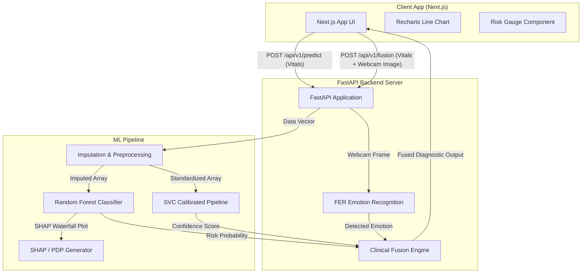

# BioSense AI — HealthGuard System

    

> A multimodal clinical intelligence platform that combines physiological biomarkers, machine learning, and facial emotion analysis to assist in early-stage diabetes risk assessment.

---

## Live Demo

- **Frontend:** https://biosenseai.vercel.app/
- **Backend API:** https://biosense-ai-production.up.railway.app
- **API Docs (Swagger):** https://biosense-ai-production.up.railway.app/docs

---

## Project Screenshots

<p align="center">
  
  <br />
  <em>Landing Page</em>
</p>

<p align="center">
  
  <br />
  <em>Clinician Dashboard</em>
</p>

<p align="center">
  
  <br />
  <em>Patient Portal with Webcam Emotion Tracking</em>
</p>

<p align="center">
  
  <br />
  <em>Explainability & SHAP Risk Analysis</em>
</p>

---

## System Architecture



---

## Features

### Clinician Dashboard
- **Patient Risk Stratification** — classifies patients into Stable 🟢, At Risk 🟡, or High Risk 🔴 in real time.
- **Biomarker Comparison** — compares individual patient vitals against established clinical reference ranges.
- **24h Glucose Trajectory** — spline-interpolated charts that project a patient's likely glucose path over the next 24 hours.

### Patient Portal
- **Multimodal Input** — captures physical vitals alongside a webcam snapshot for emotion analysis.
- **Clinical Fusion Engine** — cross-references metabolic risk factors with detected psychological indicators.
- **Affect Standardization** — maps raw emotion labels to clinical terminology (e.g., `Elevated Stress Response`).

### ML & Explainability Pipeline
- **Missing Data Handling** — KNNImputer fills in incomplete readings before inference.
- **Dual-Model Inference** — a Random Forest classifier and a calibrated SVM run in parallel; their outputs are fused.
- **Explainability (XAI)** — generates per-prediction SHAP waterfall plots and global feature importance charts so clinicians can audit decisions.

---

## Tech Stack

### Frontend
- Next.js (App Router), React, TypeScript
- Tailwind CSS, Framer Motion, Recharts

### Backend
- FastAPI, Python, Uvicorn

### Machine Learning
- Scikit-Learn, SHAP, Pandas
- OpenCV, FER (Facial Expression Recognition)

### Deployment
- Railway (backend), Vercel (frontend), GitHub

---

## Folder Structure

```
biosense-ai/
├── frontend/               # Next.js web application
│   ├── app/                # App Router pages and layouts
│   ├── components/         # Reusable UI components (gauge, webcam, vitals)
│   └── .env.local          # Local environment config
├── backend/                # FastAPI application
│   ├── app.py              # Routes, CORS config, and Clinical Fusion Engine
│   ├── version.py          # Release version metadata
│   └── .env                # Backend environment config
├── ml/                     # ML training and inference pipeline
│   ├── dataset/            # Raw CSV datasets
│   ├── models/             # Exported models and metadata (.joblib, .json)
│   ├── artifacts/          # Evaluation plots and explainability outputs
│   ├── src/                # Preprocessing, trainer, and predictor modules
│   └── train.py            # Entry point to train and export all models
└── archive/
    └── matlab-legacy/      # Original MATLAB research scripts (archived)
```

---

## API Reference

Interactive Swagger docs are available at `http://127.0.0.1:8000/docs` when running locally.

### `GET /api/v1/health`
Returns application health status, confirming whether ML models and the emotion detector loaded correctly.

```json
{
  "status": "healthy",
  "app_name": "BioSense AI",
  "version": "1.0.0",
  "model_version": "RandomForest-v1",
  "diagnostics": {
    "ml_models_loaded": true,
    "emotion_detector_loaded": true
  }
}
```

### `POST /api/v1/predict`
Accepts a patient vitals payload and returns a diabetes risk probability, classification label, top contributing features, and a 24-hour glucose trajectory.

- **Body:** `VitalsPayload` JSON (age, sex, BMI, glucose, SBP, etc.)
- **Response:** `{ risk_probability, label, top_features, trajectory }`

### `POST /api/v1/fusion`
Runs the full Clinical Fusion Engine — accepts both vitals and an optional webcam image, then returns a combined diagnostic recommendation.

- **Body:** Multipart form with `vitals` (JSON string) and an optional `image` file
- **Response:** `{ fused_insight, physical_risk_prob, emotion_affect, confidence }`

---

## Deployment

| Layer      | Platform  |
|------------|-----------|
| Frontend   | Vercel    |
| Backend    | Railway   |
| ML Models  | Loaded at FastAPI startup from `/ml/models/` |

### Required Environment Variables

**Frontend (`frontend/.env.local`)**
```env
NEXT_PUBLIC_API_URL=<your_backend_url>
```

**Backend (`backend/.env`)**
```env
ALLOWED_ORIGINS=<comma_separated_frontend_origins>
```

---

## Local Setup

### Prerequisites
- Node.js v20+
- Python 3.9+

### 1. Backend & ML

```bash
cd backend
pip install -r requirements.txt
pip install -r ../ml/requirements.txt
python -m uvicorn app:app --host 127.0.0.1 --port 8000 --reload
```

> If the `/ml/models/` directory is empty, run `python ml/train.py` first to train and export the models.

### 2. Frontend

```bash
cd frontend
npm install
npm run dev
```

Open `http://localhost:3000` in your browser.

---

## Roadmap

- [ ] JWT-based authentication
- [ ] Patient history and longitudinal tracking
- [ ] EHR (Electronic Health Record) integration
- [ ] Interactive XAI dashboard
- [ ] Docker support
- [ ] CI/CD pipeline
- [ ] Model drift monitoring

---

## Contributors

| Name | Role |
|------|------|
| [Syed Uzair Mohiuddin](https://github.com/SyedUzaiir) | Full Stack & AI Engineer |
| [Sarasam Chinmaee Reddy](https://github.com/Chinmayee04-sys) | AI Architect |
| [Manohar Yadav Boddu](https://github.com/Manohar0303) | Machine Learning Engineer |

---

## License

This project is licensed under the MIT License. See the [LICENSE](LICENSE) file for details.
