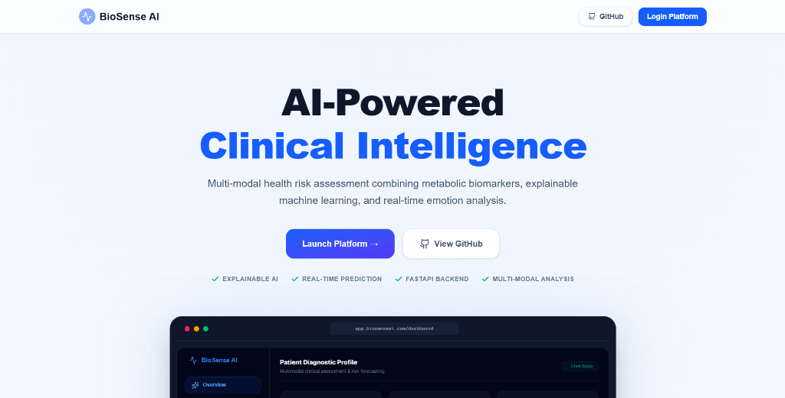
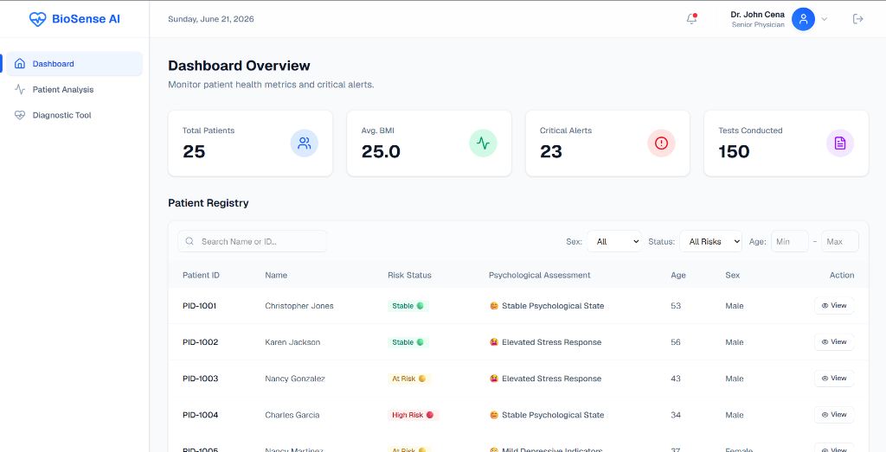
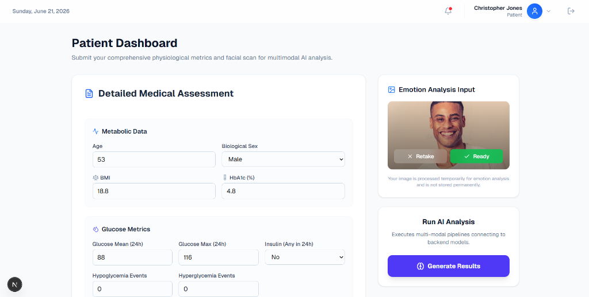
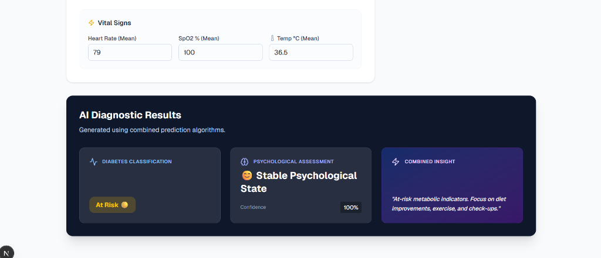
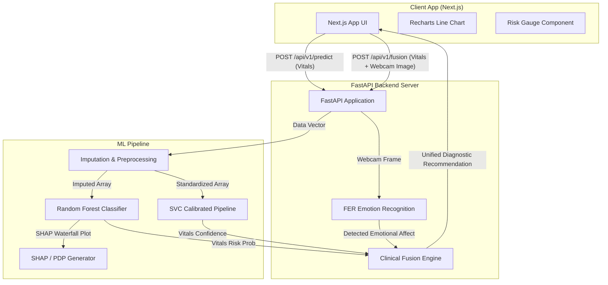

# 🩺 BioSense AI: HealthGuard System

    

> **AI-powered multimodal healthcare platform combining physiological biomarkers, explainable machine learning, and emotion-aware clinical assessment.**

---

## 🌐 Live Demo

- 🚀 **Frontend:** https://biosenseai.vercel.app/
- ⚙️ **Backend API:** https://biosense-ai-production.up.railway.app
- 📖 **API Documentation:** https://biosense-ai-production.up.railway.app/docs


---

## 📸 Project Preview

<p align="center">
  
  <br />
  <em>1. BioSense AI Landing Page</em>
</p>

<p align="center">
  
  <br />
  <em>2. Clinician Dashboard</em>
</p>

<p align="center">
  
  <br />
  <em>3. Patient Portal & Webcam Emotion Tracking</em>
</p>

<p align="center">
  
  <br />
  <em>4. Explainability & SHAP Risk Analysis</em>
</p>


---

## 📐 System Architecture

The following diagram illustrates how the frontend app, backend API routes, and machine learning components interact:



---

## 🌟 Key Features

### 👨‍⚕️ Clinician Dashboard
- **Risk Stratification**: Real-time patient classification into Stable 🟢, At Risk 🟡, and High Risk 🔴 status.
- **Biomarker Analytics**: Instant patient vital comparison with clinical benchmark limits.
- **24h Risk Trajectories**: Monotonic spline-interpolated line charts forecasting projected blood glucose paths.

### 📱 Patient Portal
- **Multimodal Capture**: Physical metric inputs coupled with webcam facial analysis.
- **Clinical Fusion Engine**: Cross-references physical diabetes indicators with psychological state evaluations.
- **Standardized Affect**: Converts raw facial labels into clinical affect terminology (e.g. `Elevated Stress Response`).

### 🧬 ML & Explainability (XAI) Pipeline
- **Imputation**: Automated missing data treatment using a robust KNNImputer model.
- **Dual Ensemble**: Combines Random Forest Classification with a calibrated Support Vector Classifier pipeline.
- **Deep Explanations**: Generates local instance SHAP Waterfall plots and Global Feature Importance trends.

---

## 🛠️ Tech Stack

### Frontend
* **Next.js** (App Router)
* **React**
* **TypeScript**
* **Tailwind CSS**
* **Framer Motion**
* **Recharts**

### Backend
* **FastAPI**
* **Python**
* **Uvicorn**

### Machine Learning
* **Scikit-Learn**
* **SHAP**
* **Pandas**
* **OpenCV**
* **FER** (Face Emotion Recognition)

### Deployment
* **Railway**
* **Vercel**
* **GitHub**

---

## 📂 Folder Structure

```
biosense-ai/
├── frontend/               # Next.js web application
│   ├── app/                # App Router files
│   ├── components/         # Reusable gauge, webcam, and vitals layout parts
│   └── .env.local          # Local Next.js connection setup
├── backend/                # FastAPI application
│   ├── app.py              # API router, CORS origins, and Fusion Engine
│   ├── version.py          # Release version metadata
│   └── .env                # Local backend configs
├── ml/                     # Python ML training & inference pipeline
│   ├── dataset/            # CSV dataset storage
│   ├── models/             # Trained models & metadata (.joblib, .json)
│   ├── artifacts/          # Explainability & evaluation plots
│   ├── src/                # Preprocessing, trainer, and predictor classes
│   └── train.py            # Orchestrator to train and export models
└── archive/
    └── matlab-legacy/      # Original research MATLAB scripts (archived)
```

---

## 🔌 API Endpoints

FastAPI automatically generates interactive Swagger documentation at `http://127.0.0.1:8000/docs`.

### `GET /api/v1/health`
Checks application health, confirming whether the models and classifiers loaded correctly.
- **Response Example**:
  ```json
  {
    "status": "healthy",
    "app_name": "BioSense AI",
    "version": "1.0.0",
    "model_version": "RandomForest-v1",
    "diagnostics": {
      "ml_models_loaded": true,
      "emotion_detector_loaded": true
    }
  }
  ```

### `POST /api/v1/predict`
Calculates diabetes risk category and generates the 24-hour glucose trajectory coordinate array.
- **Payload**: `VitalsPayload` JSON object (age, sex, BMI, glucose, SBP, etc.)
- **Response**: Risk probability, classification label (`Stable 🟢`, `At Risk 🟡`, `High Risk 🔴`), top features, and trajectory list.

### `POST /api/v1/fusion`
The unified Clinical Fusion Engine. Accepts vitals JSON variables and an optional webcam snapshot.
- **Payload**: Multipart form data with an optional `image` file and a `vitals` JSON string.
- **Response**: Fused insight, physical risk probability, detected emotional affect, and confidence level.

---

## ☁️ Deployment

### Frontend
- Hosted on **Vercel**

### Backend
- Hosted on **Railway**

### Machine Learning Models
- Loaded dynamically during FastAPI server startup.

### Environment Variables

#### Frontend
```env
NEXT_PUBLIC_API_URL
```

#### Backend
```env
ALLOWED_ORIGINS
```

### Health Endpoint
- Monitor status via `GET /api/v1/health`

---

## 🚀 Local Setup

### Prerequisites
- Node.js (v20+)
- Python (3.9+)

### 1. Backend API & ML Installation
Navigate to `/backend` and install dependencies:
```bash
cd backend
pip install -r requirements.txt
pip install -r ../ml/requirements.txt
```

Start the FastAPI application:
```bash
python -m uvicorn app:app --host 127.0.0.1 --port 8000 --reload
```

*(Note: Verify that models exist inside `/ml/models`. If models are missing, run `python ml/train.py` to train and export them first).*

### 2. Frontend Installation
Navigate to `/frontend` and install Node packages:
```bash
cd ../frontend
npm install
```

Start the Next.js development server:
```bash
npm run dev
```

Open `http://localhost:3000` inside your browser.

---

## 🚀 Roadmap

- [ ] Authentication
- [ ] Patient History
- [ ] Electronic Health Record Integration
- [ ] Explainable AI Dashboard
- [ ] Docker Support
- [ ] CI/CD Pipeline
- [ ] Model Monitoring

---

## 👥 Contributors

| Name | Role |
|------|------|
| [Syed Uzair Mohiuddin](https://github.com/SyedUzaiir) | Full Stack & AI Engineer |
| [Sarasam Chinmaee Reddy](https://github.com/Chinmayee04-sys) | AI Architect |
| [Manohar Yadav Boddu](https://github.com/Manohar0303) | Machine Learning Engineer |

---

## 🛡️ License
This project is licensed under the standard MIT License. See the [LICENSE](LICENSE) file for details.
